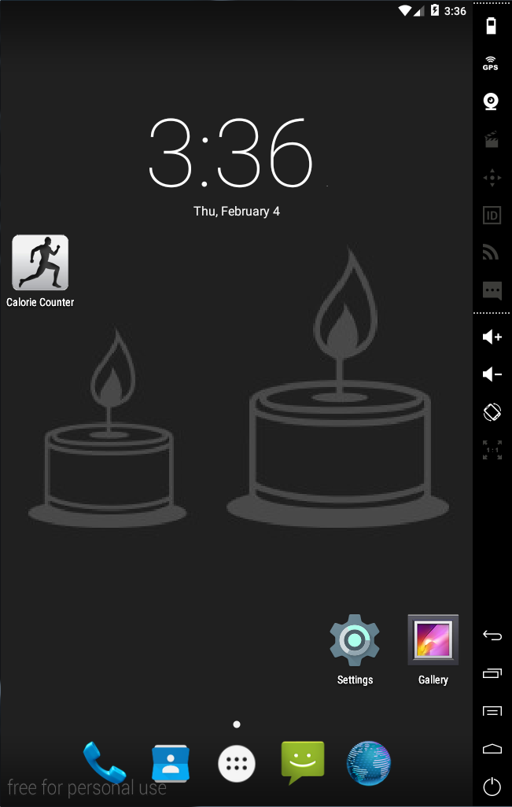
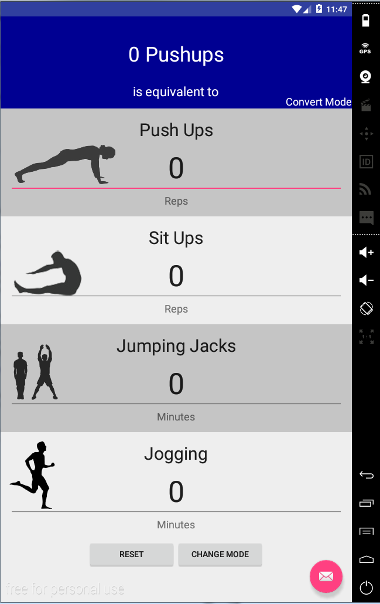
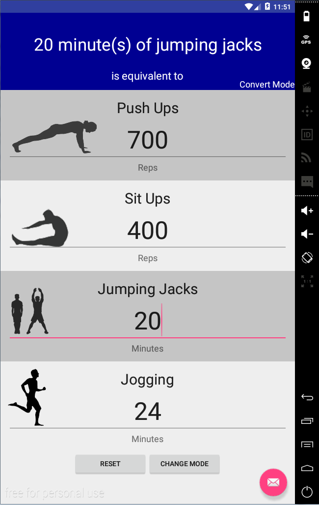

# PROG 01: Crunch Time

Calorie Counter is an easy way to count calories burned in exercise, or convert between exercise types.

Simply open the app and input the amount of each exercise you performed, and see the amount of calories you burned at the top of the screen.

Tapping the reset button will set all your inputs back to 0. Tapping the "change mode" button will switch between Count Mode, which is the default mode for displaying calories burned, and "convert mode" in which you can convert between exercise types. The text and color of the top will change to indicate which mode you are in.

In convert mode, you can input how many of one exercise you performed, and the app will display the equivalent amount of other exercises you need to perform to burn the same amount of calories in their respective boxes. Click again on "change mode" will bring you back to count mode.

## Authors

Michael Wu ([wu.michael.m@berkeley.edu](mailto:wu.michael.m@berkeley.edu))

## Demo Video

See [Calorie Counter in action] (https://youtu.be/sjQGfcVK8L4)

## Screenshots

## Acknowledgments

* [Shutterstock](http://www.shutterstock.com/), from which all the images in the app were created.
