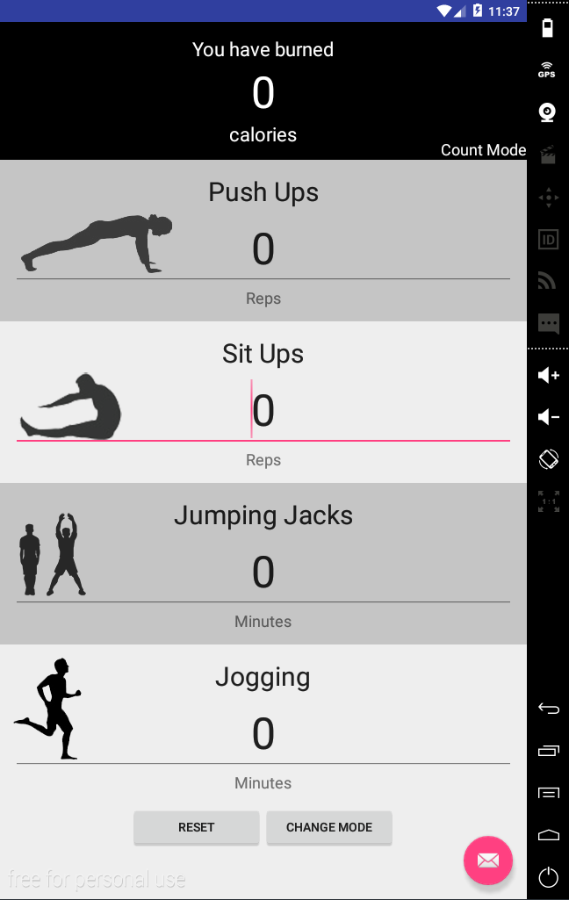

# PROG 01: Crunch Time

Calorie Counter: A easy way to count calories burned in exercise.

Simply open the app and input the amount of each exercise you performed, and see the amount of calories you burned at the top in real time!

## Authors

Michael Wu ([wu.michael.m@berkeley.edu](mailto:wu.michael.m@berkeley.edu))

## Demo Video

See [your demo video title here] (https://link_to_your_video)

## Screenshots

## Acknowledgments

* [Shutterstock](http://www.shutterstock.com/), from which all the images in the app were created.
